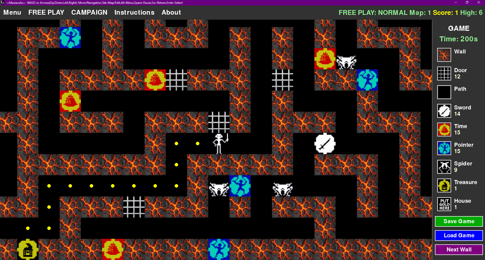

# MaziacsAs

**Лабиринт-приключение с поиском сокровищ, боями с пауками, кампанией и редактором карт**

---

🛠️ **Технологии:**
- 🐍 **Python 3.12** (проверено в версиях 3.10–3.12)
- 🎮 **Pygame** — графический движок
- 📦 Сборка в `.exe` через **PyInstaller**

---

> ⚠️ **Проект в стадии активной разработки**
>
>🧹 Код в процессе доработки. Архитектура и качество кода будут улучшаться в следующих версиях.
>
> 💬 Конструктивные замечания и советы по коду приветствуются! Создавайте [Issue](https://github.com/AS7go/MaziacsAs/issues) или пишите в Telegram
>
>
> 
> **Исходный код в директории:** [**Project1**](https://github.com/AS7go/MaziacsAs/tree/main/Project1/)
> 
> **Рабочая версия игры (MaziacsAs.exe) доступна в архиве - 📦 Скачать:** [**MaziacsAs.zip**](https://github.com/AS7go/MaziacsAs/raw/main/MaziacsAs.zip) (~17,9 МБ)
> 
> 
> Следите за обновлениями!

---

## О проекте

**MaziacsAs** — это захватывающая игра-лабиринт, где вы управляете героем, исследующим запутанные коридоры в поисках сокровищ, сражаетесь с пауками, собираете полезные предметы и находите путь к цели. Игра сочетает в себе элементы стратегии, головоломки и экшена, предлагая множество уровней сложности и уникальный режим кампании. Также доступен встроенный редактор карт для создания, редактирования, загрузки и обмена собственными лабиринтами.

### Основные цели игры

- Найти сокровище — исследуйте лабиринт и отыщите спрятанный клад
- Доставить клад домой — вернитесь в стартовую точку с сокровищем
- Уничтожить всех пауков — используйте мечи, чтобы очистить лабиринт от врагов
- Выжить — избегайте столкновений с пауками без оружия и следите за временем

---

## Геймплей

MaziacsAs — это игра с элементами стратегии и головоломки. Каждый уровень генерируется случайным образом, но вы также можете создавать собственные карты во встроенном редакторе (**Menu → Edit Map**), сохранять и загружать их через меню (**Menu → Save/Load Map**).

> Подробнее о редакторе карт — в разделе [Редактор карт](#редактор-карт).

### Основные механики

- Охота на пауков — убивайте пауков, чтобы очистить лабиринт от угрозы
- Боевая система — собирайте мечи на стенах, чтобы сражаться с врагами
- Поиск сокровищ — найдите легендарный артефакт и доставьте его домой
- Управление временем — у вас ограниченное время, следите за таймером
- Указатели пути — узники подскажут маршрут к цели
- Бонусы времени — собирайте бонусы, чтобы продлить время в лабиринте

### Миссии

У вас есть два пути к победе:

1. Найти сокровище и вернуть его в дом
2. Уничтожить всех пауков в лабиринте

Выберите свою стратегию!

---

## Режимы игры

### Свободная игра
Выбирайте уровень сложности: от Easy до Nightmare. Каждый уровень предлагает новые вызовы: больше пауков, больше мечей, больше испытаний.

### Кампания
Пройдите все 7 уровней сложности, победив по 3 раза на каждом. Станьте настоящим чемпионом лабиринта.

---

## Уровни сложности

**EASY** — Маленький лабиринт, мало врагов, много времени

**NORMAL** — Стандартный лабиринт, умеренное количество врагов

**HARD** — Большой лабиринт, много пауков, ограниченное время

**CHALLENGING** — Огромный лабиринт, серьезный вызов

**DIFFICULT** — Экстремальные размеры, масса врагов

**EXTREME** — Почти невозможные условия

**NIGHTMARE** — Максимальный уровень сложности — только для настоящих героев

---

## 🎮 Управление

### В игре

| Клавиша | Действие |
|---------|----------|
| `↑` `↓` `←` `→` или `W` `A` `S` `D` | Движение по лабиринту / навигация в меню |
| `Пробел` | Пауза |
| `Tab` | Переключение между игрой, картой и редактором |
| `Alt` | Открыть главное меню |
| `Esc` | Закрыть меню / вернуться назад |
| `Enter` | Выбрать пункт меню / подтвердить действие |
| `Клик мыши` | Перемещение к выбранной клетке или взаимодействие |

---

## Редактор карт

Создавайте свои собственные лабиринты с помощью встроенного редактора.

### 🛠️ Инструменты редактора

| Инструмент | Описание |
|------------|----------|
| **Стена (Wall)** | Строить стены |
| **Дверь (Door)** | Создавать проходы |
| **Путь (Path)** | Прокладывать дороги |
| **Меч (Sword)** | Размещать оружие |
| **Время (Time)** | Добавлять бонусы времени |
| **Указатель (Pointer)** | Расставлять подсказки - путь |
| **Паук (Spider)** | Размещать врагов |
| **Сокровище (Treasure)** | Размещать клад |
| **Дом (House)** | Устанавливать стартовую точку |

### 🖱️ Управление в редакторе

| Действие | Описание |
|----------|----------|
| **Левый клик** | Разместить выбранный объект |
| **Правый клик** | Удалить объект |
| **Клик по иконке** | Выбрать инструмент в боковой панели |

---

## 💾 Сохранение и загрузка

| Действие | Описание |
|----------|----------|
| **Сохранить карту** | Сохранить созданный лабиринт в файл `.map` |
| **Загрузить карту** | Загрузить ранее сохранённый лабиринт |
| **Сохранить игру** | Сохранить текущий прогресс в файл `.save` |
| **Загрузить игру** | Продолжить с сохранённого состояния |

---

## Особенности

- Анимированные спрайты — персонажи и враги оживают в движении
- Звуковое сопровождение — погружение в атмосферу приключений
- Управление мышью — кликните по карте, чтобы переместиться
- Система очков — зарабатывайте баллы за победы и достижения
- Рекорды — ваши лучшие результаты сохраняются
- Генерация лабиринта — каждый раз новый, непредсказуемый
- Интеллектуальные враги — пауки преследуют игрока и могут загонять в ловушки
- Динамические бои — анимация атак и эффекты победы

---

## Системные требования

- Операционная система: Windows (в перспективе macOS / Linux)

---

## 🚀 Установка и запуск

### Для игроков (готовый `.exe`)

1. Скачайте архив [**MaziacsAs.zip**](https://github.com/AS7go/MaziacsAs/raw/main/MaziacsAs.zip)
2. Распакуйте в любую папку
3. Запустите `MaziacsAs.exe`

> 📌 **Проверка целостности:**  
> Сравните SHA-256 хеш скачанного файла с содержимым [`MaziacsAs.zip.sha256`](https://github.com/AS7go/MaziacsAs/raw/main/MaziacsAs.zip.sha256)

---

## Исходный код

Исходный код игры находится в папке [`Project1`](https://github.com/AS7go/MaziacsAs/tree/main/Project1/).
Следите за обновлениями!

---

## Контакты разработчика

- **Telegram:** [@Aleksandr_Sh17](https://t.me/Aleksandr_Sh17)
- **Email:** [sh17aleksandr@gmail.com](mailto:sh17aleksandr@gmail.com)

---

## Поддержать проект 💛

Если игра вам нравится и вы хотите помочь её развитию — любая поддержка очень важна.

> Донаты добровольны.

### Способы поддержки:

**1. Перевод через Telegram (быстро и без комиссии):**
Вы можете перевести USDT через встроенный сервис **Wallet** в Telegram.
- Напишите мне в личные сообщения: [@Aleksandr_Sh17](https://t.me/Aleksandr_Sh17)
- Внизу чата нажмите на иконку «скрепки» -> **Wallet (Кошелек)** -> **Отправить** -> **USDT**.

**2. Перевод USDT на:**

**USDT / Сеть TON**  
UQBO4Yl3zoAy7M-YLg01dsx8mrhM0vY5abhkxrWGsVS2FlnO

**USDT / Сеть TRC20 (Tron)**  
TFTy9eeDZJjypeHezcgKdnGmccfREHz8TH

⚠️ **Важно:** Отправляйте только через указанную сеть. Ошибка = потеря средств.

---

Также вы можете:

- Поставьте звезду ⭐ этому репозиторию — это поможет проекту стать заметнее
- Расскажите об игре друзьям
- Ваша поддержка вдохновляет на развитие!

---

## Благодарности

Спасибо за внимание к проекту MaziacsAs! Ваша поддержка вдохновляет на развитие проекта.

---

## 📜 Лицензия

**Source Available** — проект открыт для изучения и некоммерческого использования.

Вы можете:
- Изучать код и разбираться, как он устроен
- Менять код под свои нужды на своём компьютере

Для использования игры и кода в коммерческих целях необходимо предварительно обговорить условия с разработчиком.

По всем вопросам обращайтесь:

- **Telegram:** [@Aleksandr_Sh17](https://t.me/Aleksandr_Sh17)
- **Email:** [sh17aleksandr@gmail.com](mailto:sh17aleksandr@gmail.com)

Спасибо за уважение к моему труду! 🙌

Подробнее см. [LICENSE.txt](LICENSE.txt)

---

*В разработке. Следите за обновлениями!*
